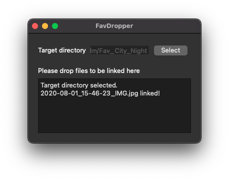

# FavDropper
This simple tool does exactly one thing. It symlinks files scattered across the filesystem into a single target directory using drag-and-drop. 

Pick a target directory, move FavDropper to the corner of your screen and start throwing files at it. Very useful to e.g. create a folder containing your favorite holiday pictures without actually copying or moving them. **Pro tip**: Running multiple instances with different target directories effectively allows you to tag files: Create photo collections of landscapes, cities, or people from multiple source directories, simply by dragging the photos into the corresponding FavDropper windows.

## Main Features
* KISS: Just one simple function - Easily create symlinks.
* Symlinks are intentionally relative to target directory. Use this tool on USB drives, network shares, or move your collections around later. The links will stay!
* Pure symlinks. No proprietary meta data. The links will stay even if the tool is gone. Symlinks can also be processed by just about any application which can handle files! Say goodbye to proprietary database-backed photo libraries!
* Cross-platform compatible. Works with any OS supporting Python 3, PyQt5, and symbolic links (tested on Linux and macOS).

## Usage
* Requirements: Python 3
* Install PyQt5 either through your OS or using pip: `pip install -r requirements.txt`
* Run FavDropper: `python3 favdropper.py`
* A `.desktop` file for Linux is included which can be copied to `~/.local/share/applications/`. That will make FavDropper available through your application launcher. **Attention!** This will require updating `favdropper_run.sh` to the paths of your Python interpreter and your location of this repository!
